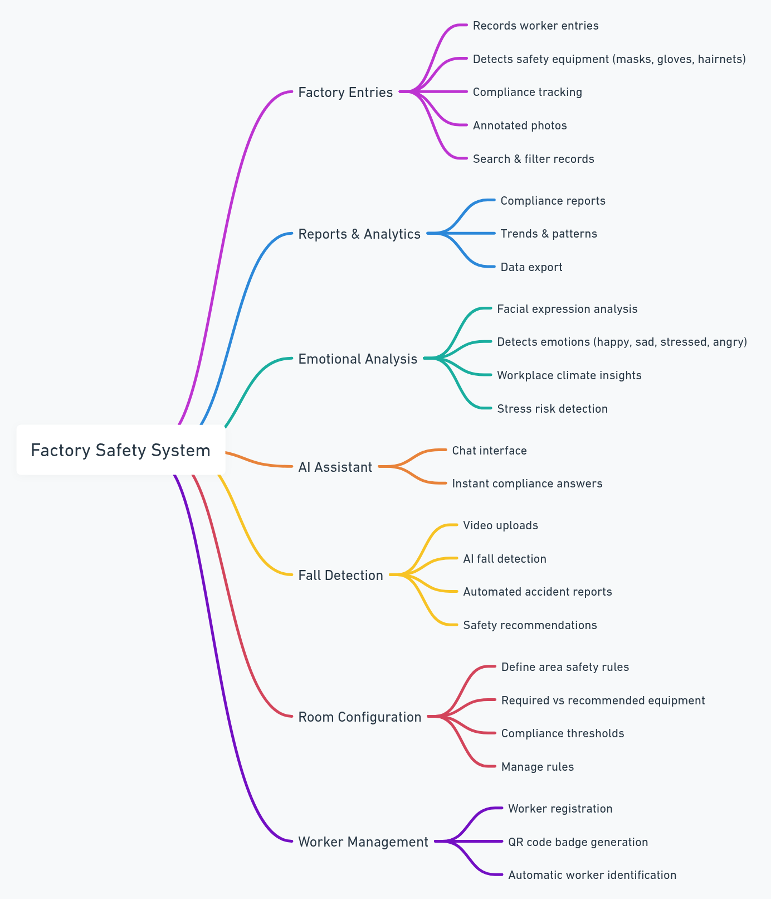

# 🦆 Quack as a Service - Factory Safety Monitoring System

## 🎯 Problem & Solution

### The Problem

Factory workers face numerous safety risks due to:

- **Inadequate PPE compliance** - Workers entering dangerous areas without proper safety equipment
- **Lack of real-time monitoring** - No system to track who enters which rooms and when
- **Manual safety checks** - Time-consuming and error-prone manual verification processes
- **No emotional state awareness** - Stressed or unwell workers are more accident-prone
- **Fall detection gaps** - Accidents go unnoticed without immediate response systems

### Our Solution

**Quack as a Service** is an AI-powered factory safety monitoring system that provides:

**Smart PPE Detection** - AI vision models automatically detect masks, gloves, hard hats, and other safety equipment

**Room-Based Access Control** - Customizable equipment requirements per room with automatic approval/denial

**QR Code User Identification** - Unique QR codes for seamless worker identification

**Emotional State Monitoring** - AWS Rekognition analyzes worker emotional state for safety insights

**Fall Detection** - YOLO-based computer vision detects falls and accidents in real-time

**Real-Time Dashboard** - Comprehensive monitoring with analytics and reporting

**AI-Powered Analytics** - AWS Bedrock provides intelligent insights and recommendations

## 🌟 System Features Overview



## Live Demo


Better Quality download available here -> [Live-Demo.mp4](https://github.com/FranciscoGaspar/quack-as-a-service/blob/main/Live-Demo.mp4)

## 🚀 Quick Start

```bash
# Clone and start everything
git clone git@github.com:FranciscoGaspar/quack-as-a-service.git
cd quack-as-a-service
./start.sh
```

**Access the applications:**

- 🌐 **Frontend Dashboard**: http://localhost:3000
- 🔧 **API Documentation**: http://localhost:8000/docs
- 📊 **API Health Check**: http://localhost:8000/health

## 🛠️ Tech Stack

### Backend (FastAPI + Python)

- **FastAPI** - Modern, fast web framework with automatic API docs
- **AWS Aurora -> PostgreSQL + SQLAlchemy** - Robust database with ORM
- **AWS Rekognition** - Emotional analysis and face detection
- **AWS Bedrock** - AI-powered analytics and insights
- **YOLO** - Fall detection computer vision model
- **Grounding DINO** - Zero-Shot vision model
- **PIL + OpenCV** - Image processing and computer vision
- **QR Code Generation** - Automatic user QR code creation

### Frontend (Next.js)

- **Next.js 15** - Modern React framework with App Router
- **TypeScript** - Type-safe development
- **Tailwind CSS** - Utility-first CSS framework
- **Radix UI** - High-quality, accessible component library
- **TanStack Query** - Powerful data synchronization

## 📁 Project Structure

```
quack-as-a-service/
├── 🚀 start.sh                    # One-command startup script
├── 🛑 stop.sh                     # Stop all services
├── 🐳 docker-compose.yml          # Database setup
└── backend/                       # Python FastAPI Backend
    ├── 🌟 main.py                 # FastAPI application entry point
    ├── 🏗️ api/routes/             # API route handlers
    │   ├── users.py               # User management + QR codes
    │   ├── entries.py             # Room entry tracking + PPE detection
    │   ├── fall_detection.py      # Fall detection AI service
    │   ├── room_configurations.py # Room equipment requirements
    │   └── health.py              # Health check endpoints
    ├── 🗄️ database/               # Database models and services
    │   ├── models.py              # SQLAlchemy models
    │   ├── services.py            # Database service layer
    │   └── migrations/            # Database migrations
    ├── 🤖 services/               # AI and ML services
    │   ├── bedrock_analytics.py   # AWS Bedrock AI analytics
    │   ├── rekognition_emotions.py # AWS Rekognition emotions
    │   └── fall_detection.py      # YOLO fall detection
    ├── 🔧 utils/                  # Utility functions
    ├── 📋 requirements.txt        # Python dependencies
    └── 📋 requirements-ml.txt     # ML/AI dependencies
└── frontend/                      # Next.js React Frontend
    ├── 📦 package.json            # Node.js dependencies
    └── src/
        ├── 📱 app/(dashboard)/    # Dashboard pages
        │   ├── page.tsx           # Main dashboard
        │   ├── factory-entries/   # Entry monitoring
        │   ├── emotional-analysis/ # Emotion insights
        │   ├── live-capture/      # Real-time monitoring
        │   ├── room-configurations/ # Room setup
        │   ├── ai-chat/           # AI assistant
        │   ├── accidents/         # Fall detection alerts
        │   └── reports/           # Analytics and reports
        ├── 🎨 components/         # Reusable React components
        ├── 🔗 services/           # API communication
        └── 🪝 hooks/              # Custom React hooks
```

## 🔧 System Requirements

- **Python 3.8+** for backend AI services
- **Node.js 18+** for frontend development
- **PostgreSQL** (provided via Docker)
- **AWS Account** (optional - for advanced AI features)

## 📖 Manual Setup

### 0. Download Fall Detection Model

```bash
# Download YOLO11 fall detection model from Hugging Face
cd backend
wget https://huggingface.co/leeyunjai/yolo11-falldetect/resolve/main/falldetect-11x.pt

# Or using curl
curl -L -o falldetect-11x.pt https://huggingface.co/leeyunjai/yolo11-falldetect/resolve/main/falldetect-11x.pt
```

> **Note**: The fall detection model (`falldetect-11x.pt`) from [Hugging Face](https://huggingface.co/leeyunjai/yolo11-falldetect/blob/main/falldetect-11x.pt) must be placed in the `backend/` root directory for accident detection features to work.

### 1. Database Setup

```bash
# Start PostgreSQL database
docker-compose up -d db
```

### 2. Backend Setup

```bash
cd backend

# Create Python virtual environment
python3 -m venv venv-ml
source venv-ml/bin/activate

# Install dependencies
pip install -r requirements.txt
pip install -r requirements-ml.txt

# Initialize database
python -c "from database.connection import init_db; init_db()"
python database/migrate.py

# Seed database with sample data (optional)
python3 ./backend/seed_custom.py --clean --all 6

# Start API server
python main.py
```

### 3. Frontend Setup

```bash
cd frontend

# Install dependencies
npm install

# Start development server
npm run dev
```

## 🌟 Key Features

### 👤 User Management with QR Codes

- Create factory workers with unique identifiers
- Generate and download QR code badges
- Scan QR codes for instant user identification

### 🏭 Smart Room Entry System

- **Equipment Detection**: AI automatically detects PPE compliance
- **Room Configurations**: Set custom equipment requirements per room
- **Approval System**: Automatic entry approval/denial based on safety scores
- **Real-time Tracking**: Monitor who enters which rooms and when

### 🤖 AI-Powered Safety Features

- **Emotional Analysis**: Monitor worker emotional state for safety insights
- **Fall Detection**: Real-time accident detection using computer vision
- **Smart Analytics**: AI-generated insights and safety recommendations
- **Predictive Alerts**: Identify potential safety risks before they occur

### 📊 Comprehensive Dashboard

- **Live Monitoring**: Real-time room entry and safety status
- **Analytics Dashboard**: Safety metrics, compliance rates, and trends
- **Incident Reports**: Automated accident detection and reporting
- **AI Assistant**: Chat with AI for safety insights and recommendations

## 🔑 Getting Started with Users

### Create a New User

```bash
# Create a factory worker
curl -X POST "http://localhost:8000/users" \
  -H "Content-Type: application/json" \
  -d '{
    "name": "John Factory Worker"
  }'
```

### Generate QR Code for User

```bash
# Generate QR code for user ID 1
curl -X POST "http://localhost:8000/users/1/generate-qr-code" \
  -H "Content-Type: application/json"
```

### Download QR Code Image

```bash
# Download QR code as PNG image
curl -X GET "http://localhost:8000/users/1/qr-code-image \
  --output "user_1_qr_code.png"
```

## 🎯 Typical Usage Workflow

1. **👤 Create Workers**: Add factory workers to the system
2. **🔖 Generate QR Codes**: Create unique QR code badges for each worker
3. **🏠 Configure Rooms**: Set up equipment requirements for different areas
4. **📸 Room Entry**: Workers scan QR codes and take safety photos at room entrances
5. **🤖 AI Analysis**: System automatically detects PPE compliance and emotional state
6. **✅ Approval Decision**: Automatic entry approval/denial based on safety scores
7. **📊 Monitor Dashboard**: Real-time tracking of entries, compliance, and incidents
8. **🚨 Incident Report**: Fall detection with AI generated reported
9. **📈 Analytics Review**: AI-generated insights for improving factory safety

## 👥 Team

- **Guido Pereira**
- **Francisco Gaspar**
- **Francisco Oliveira**
- **João Ferreira**

---

_Built with ❤️ for factory worker safety and AI-powered industrial monitoring 🦆_
